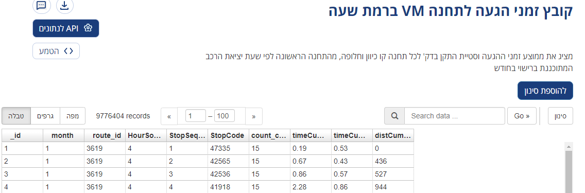

```{=html}

<style>

div { direction:rtl;}

pre{ direction:ltr;}

</style>
```
## תוכן עניינים

-   משחקים עם מידע תחצ בזמן אמת

-   משחקים עם מידע סלולרי

-   משחקים עם סקר הרגלי נסיעה

-   ערעור על הנחות בתכנון תחבורה
## יותר מדי על עצמי
עדו קליין, 38, ד"ר לגאוגרפיה, נשוי ואב להרבה, חיפאי מלידה וירושלמי בהווה.  
ד"ר בנושא התנהגות תחברותית בהינתן מערכות הכוונת מסלול ממקסמות תועלת חברתית, אצל ערן בן אליא.  
בוגר תכנית ממשק, התחמות במשרד התחבורה אצל שי קדם בתחום המודלים התחבורתיים בישראל, ריכוז שולחן עגול.  
פוסטדוק אצל פרופ' בננסון בתל אביב. יצירת מודל מאטסים לירושלים. בחינת מודל מאטסים על קורונה. כתיבת נייר מדיניות חניה לירושלים. 


## משחקים עם מידע תחצ בזמן אמת

### השוואה בין המקורות המתפרסמים של משרד התחבורה לבין הנתונים האגורים בסדנא לידע ציבורי

במידע תחצ מבוסס זמן אמת - אנחנו מעוניינים ב4 רכיבים: מוקדים (תחנות), קשתות (רחובות או תשתית בהם עובר תחצ), מסלולים (קווי תחצ), וכלים.

המידע המוצג בדאטה גוב, בתלתן ובחצב אינו מידע זמן אמת, אלא מידע מעובד. אציג מגוון מקורות בדאטה גוב, המתעדכנים בצורה תדירה יחסית או משקפים מצב "חי".

### תחנות אוטובוסים


[קישור](https://data.gov.il/dataset/bus_stops/resource/e873e6a2-66c1-494f-a677-f5e77348edb0)

### הגעה לתחנה לפי קו-כיוון - ברמת שעה



[קישור](https://data.gov.il/dataset/arrivaltostationhours/resource/c8e374a6-debd-41b7-8b7c-ffb2824bc3c3)

### הגעה לתחנה לפי קו כיוון - ברמת יום ושעה


[קישור](https://data.gov.il/dataset/arrivaltostationdayandhours/resource/efc060ca-29e9-4061-812e-16e68fdf0cfc)

### ציי רכב


[קישור](https://data.gov.il/dataset/bus_fleet/resource/91d298ed-a260-4f93-9d50-d5e3c5b82ce1)

### רכבת תכנון מול ביצוע


[קישור](https://data.gov.il/dataset/train_trip/resource/6cf35ec2-c0eb-4ef0-a904-f093dab0abfd)

### תכנון וביצוע אוטובוסים


[קישור](https://data.gov.il/dataset/bus_rishui_bitzua_2021/resource/edb6f096-f7f1-465f-8d4f-6e0811709f83)

### רישוי אוטובוסים


[קישור](https://data.gov.il/dataset/licensing_bus_system/resource/8fd3aa6c-a64f-4c91-818e-fd35017cd19b)

### מסלקה לתחנה


[קישור](https://data.gov.il/dataset/tikufim_station_2022/resource/7382a5e4-f12c-4644-87c1-e6942da3ee92)

### מסלקה לקו


[קישור](https://data.gov.il/dataset/tikufim-2021/resource/bfd22231-7a8b-4fc0-91bd-342397860ab5)

### מהירות נסיעה של אוטובוסים


[קישור](https://data.gov.il/dataset/bus_speed/resource/ccea1923-e1b2-4b64-a334-968235adc415)

עם זאת, למשתמשים קיימים שני מקורות אחרים, אחד פתוח לחלוטין - הGTFS:


[קישור](https://www.gov.il/he/departments/general/gtfs_general_transit_feed_specifications)

מידע חי המועבר ישירות לאפליקציות ולשלטי התחנות - סירי


[קישור](https://www.gov.il/he/departments/general/real_time_information_siri)

מקורות אלו אינם מעובדים, נמסרים בפורמט הדורש מיומנות עיבוד גבוהה הכוללת מספר קישורים טבלאיים מורכבים.

### stride api

הסדנא לידע ציבורי מתעסקת באיסוף מידע תחבורתי כבר כ5 שנים.

עם זאת, הסדנא קיבלה תקציב להנגשת הנתונים בסוף שנה שעברה, ומנגישה אותם באמצעות api יחסית פשוט לשימוש.

סוגי הקריאות השונים בAPI מאפשרים גישה למגוון נתונים, שהעיבוד שלהם הוא רק ברמה של.

הסדנא למעשה לוקחת רק את נתוני הGTFS וSIRI, ומנסה להנגיש את כל הנתונים הנאספים בצורה גולמית.


[קישור](https://open-bus-stride-api.hasadna.org.il/docs#/)

למשל - עבודה עם אקסל (בלי שורת קוד) בשביל להבין מהירות נסיעה של אוטובוסים בנקודות מסוימות:

<iframe width="1180" height="664" src="https://www.youtube.com/embed/AQpKrm8Zfds" title="כריית נתוני זמני נסיעה אוטובוסים מהAPI של הסדנא לידע ציבורי - ללא שורה אחת של קוד" frameborder="0" allow="accelerometer; autoplay; clipboard-write; encrypted-media; gyroscope; picture-in-picture" allowfullscreen data-external="1">

</iframe>

הAPI מאפשר היום שליפה של חצי מיליון שורות בקריאה, תיחום לפי קופסא תוחמת, תשאול לפי זמן, שם קו, וכו' וכו' וכו'

### יישום שלי - אנימצית bus bunching

<blockquote class="twitter-tweet">

<p lang="iw" dir="rtl">

הבטחות עדיין צריך לקיים, והנה, הצלחתי לדרדס משהו שמוצא חן בעיני. פשוט לוקח ימבה זמן לרנדר אותו. זכרו שמדובר ב14.3.2022.<br>לא עשיתי לייב טוויט כי היה קצת מייגע. <a href="https://t.co/GzAPmuue8U">https://t.co/GzAPmuue8U</a> <a href="https://t.co/Bu2XspGjVf">pic.twitter.com/Bu2XspGjVf</a>

</p>

--- Ido Klein עדו קליין (@idoklein1) <a href="https://twitter.com/idoklein1/status/1511066227418009612?ref_src=twsrc%5Etfw">April 4, 2022</a>

</blockquote>


### יישום נוסף - ניסיון למציאת צווארי בקבוק באמצעות אלגוריתם dbscan

<blockquote class="twitter-tweet"><p lang="iw" dir="rtl">אוקיי, וזה כבר ניסיון למצוא דפוסים - דיביסקאן עם תקנון אורך, רוחב ומהירות. מצא לנו מקומות שהאוטובוס נתקע בהם <a href="https://t.co/h2ubfva2BH">pic.twitter.com/h2ubfva2BH</a></p>&mdash; Ido Klein עדו קליין (@idoklein1) <a href="https://twitter.com/idoklein1/status/1519421294198018056?ref_src=twsrc%5Etfw">April 27, 2022</a></blockquote> 


## משחקים עם מידע סלולרי

הסקר הסלולרי בוצע על ידי חברת מת"ת, בשיתוף חברות מובי וקולניק, על בסיס נתוני סלקום ופלאפון, במימון משרד התחבורה, על מנת שישמשו קלט למודל הארצי החדש.  
בפועל, הונגשו לפני כשנה מטריצות ארציות בדאטה גוב, עליהן ניתן לבצע ניתוחים פרקטיים שיכולים להיות מאוד שימושיים בתכנון של נסיעות לא קצרות.  
עם זאת, בניגוד לרצון לתכנן בצורה צרה, ניתן לנסות ולתכנן בצורה רחבה יותר - לא להסתכל על צמדי מוצא יעד אלא על כלל המערכת, על מנת להבין אלו קבוצות קיימות הדורשות התייחסות בינן לבין עצמן. 

### חלוקת ישראל למטרופולינים  
יישום של הנ"ל ביצעתי באמצעות הפיכת המטריצה לרשת, והפעלת אלגוריתם לוביין, שמנסה לקבץ קהילות על הרשת, ככה שרוב הקשרים של כל אזור תנועה (או מוקד) יישארו בתוך הקהילה שלו עצמו.  

<blockquote class="twitter-tweet">

<p lang="iw" dir="rtl">

אז לכבוד החזרה שלי לפלטפורמה, אני רוצה לספר לכם על משהו שגיליתי לפני כמה ימים (האמת שכבר לפני כמה שבועות, אבל היה שדרוג לפני כמה ימים) שהעיף לי את המוח. <br><br>אנחנו הגאוגרפים מאוד אוהבים לחלק אזורים בצורה שעושה שכל. <br>למשל, חלוקת ישראל למטרפולינים(למ"ס): <a href="https://t.co/2S3p4XTiDo">pic.twitter.com/2S3p4XTiDo</a>

</p>

--- Ido Klein עדו קליין (@idoklein1) <a href="https://twitter.com/idoklein1/status/1503457710636998663?ref_src=twsrc%5Etfw">March 14, 2022</a>

</blockquote>


## משחקים עם סקר הרגלי נסיעה

### אנתרופיה של ביקושים ליעדים ככלי להבנת שירות לאזור תנועה

אנתרופיה הוא כלי שמודד את המגוונות של תופעה. אפשר לדמות אותה במידה מסוימת לסטיית תקן במידע בדיד- ככל שתופעה "מגוונת" יותר, כך האנתרופיה שלה גבוהה יותר.

ניתן לחשב אנתרופיה על התפלגות נסיעות ליעדים (אזורי תנועה שונים) ממוצא מסוים, ולנסות לזהות מקומות שיותר קשה לשרת אותם בתחבורה ציבורית, כי הביקוש לנסיעה מהם (או אליהם בבדיקה ההופכית) הוא מגוון מדי, ולא מאפשר שירות טוב.

בקישור ניתן לראות שאזורי תעשייה סובלים מאנתרופיה יחסית גבוהה., וערים חרדיות - מאנתרופיה נמוכה מאוד, שכן התושבים בהם נוסעים יחסית למעט יעדים.

לאור העובדה שהבדיקה בוצעה על סקר הרגלי נסיעה, יותר קשה להאשים בנקודה זו האבים תחבורתיים, שכן אלו אינם נרשמים כיעד. עם זאת, אזורי התנועה הסמוכים שלהם, הנהנים משירות תחצ טוב, כנראה גם יהנו מאנתרופיה גבוהה.

[קישור](https://rpubs.com/idshklein/taz_entropy)

<blockquote class="twitter-tweet"><p lang="iw" dir="rtl"><a href="https://twitter.com/hashtag/%D7%A4%D7%99%D7%93%D7%AA%D7%97%D7%91%D7%95%D7%A8%D7%94?src=hash&amp;ref_src=twsrc%5Etfw">#פידתחבורה</a> ממשיכים לשחק עם הפורמט האחוד של סקר הרגלי נסיעה, או בעברית - אחד ממקורות המידע היותר חשובים ששוחררו לציבור לאחרונה.<br>הפעם צריכים להחזיק ראש כי זה קצת מורכב אבל ממש מגניב.<br>בגדול, ככל שהצבע בהיר יותר - ככה הנסיעות שיוצאות ממנו הן למגוון יעדים רחב יותר <a href="https://t.co/Y6rDdH9gh0">pic.twitter.com/Y6rDdH9gh0</a></p>&mdash; Ido Klein עדו קליין (@idoklein1) <a href="https://twitter.com/idoklein1/status/1402703704273428481?ref_src=twsrc%5Etfw">June 9, 2021</a></blockquote> 

## ערעור על הנחות בתכנון תחבורה

### הקץ לעריצות המטריצה, או - בוא נניח את המטריצה בצד

התכנון שלנו את קווי האוטובוס, המתע"ן, הכבישים ושבילי האופנים תמיד מבקש ביקוש.

בהסתמכות על ביקוש ועל תחזיות ביקוש עתידיות אנחנו מקבעים מצב קיים, גורמים לאזורים חזקים להיות עוד יותר חזקים, ולא נותנים לחלשים להשיג אותם. 

דוגמה לכך למשל ברשת המטרו הנרקמת:

<blockquote class="twitter-tweet"><p lang="iw" dir="rtl">זה יהיה קצר ומאוד יכול להיות שכושל.אבל יאללה.<br>נוריד מהחצב את שכבת התחנות והקווים של המטרו <a href="https://t.co/KL6togSuua">https://t.co/KL6togSuua</a> <a href="https://t.co/18FjBWKMIl">pic.twitter.com/18FjBWKMIl</a></p>&mdash; Ido Klein עדו קליין (@idoklein1) <a href="https://twitter.com/idoklein1/status/1515400679061393410?ref_src=twsrc%5Etfw">April 16, 2022</a></blockquote> 


### תכנון נורמטיבי מול תכנון אמפירי  

כשאנו באים לתכנן, אנו צריכים לשאול את עצמנו מה היעדים אותם אנו באים להגשים - שיפור של מדד אמפירי קיים, כמו מהירות בכביש, ק"מ נוסע, או מזעור כמות החלפות, או להסתכל על הצד הנורמטיבי בצורה אמפירית, ולנסות לשקלל את ההזדמנויות הנוספות שהצלחנו להוסיף.  
תכנון על סמך ביקושים מאפשר לנו לעשות בעיקר תכנון אמפירי, והרבה פחות תכנון נורמטיבי, שמנסה באמצעות חזון לשנות את הביקושים ולא לקפוא על השמרים. 


### תכנון גמיש מול תכנון מקבע  

לתכנון שלנו יש השלכות בדמות תכנון שימושי קרקע, למשל לאורך צירי רק"ל, או להיפך, - תכנון "מגלומני" של שימוש קרקע מאלץ אותנו לייצר תשתיות תחבורה כבירות וכבדות. 
החיבור בין תכנון תחבורה ותכנון שימושי קרקע צריך להיות בנקודה בה כל שחקן מאפשר "גמישות מקובעת" עבור השחקן השני. 
הבטחה של היצע תחבורה ציבורית קבוע ותדיר ביותר, שלא בהכרח מצריך תשתיות כבירות אלא *קבועות*, יכול לאפשר מהצד השני הזדמנויות רבות יותר לכלל חלקי המטרופולין, ובאמצעות הנגישות המוגברת מכל חלק לכל חלק, ניתן גם להיות יותר גמישים בתכנון שימושי הקרקע, ולא לתכנן תשתיות מגלומניות ומגבירות אי שיוויון כמו מגדלים או מתקנים עצומים

<blockquote class="twitter-tweet"><p lang="iw" dir="rtl">חברים, רוצים פתרון לבעיית הפקקים?<br>חייבים לשלם על זה בנוחות הנסיעה ברכב.<br>בניגוד לרבים כאן אני אישית מאמין כי ניתן לפתור את בעיית הפקקים, אבל זה כרוך במהפכה מוחלטת של תפיסתנו את המונח &quot;ניידות&quot;, והתייחסות לעצמנו, כמו ש <a href="https://twitter.com/yuval_karmi?ref_src=twsrc%5Etfw">@yuval_karmi</a> ניסח יפה, כחבילות. <a href="https://t.co/SxiVShldol">https://t.co/SxiVShldol</a></p>&mdash; Ido Klein עדו קליין (@idoklein1) <a href="https://twitter.com/idoklein1/status/1471558633318236166?ref_src=twsrc%5Etfw">December 16, 2021</a></blockquote> <script async src="https://platform.twitter.com/widgets.js" charset="utf-8"></script>

## נספח, אם הזמן מרשה

### סיווג אזורים סטטיסטיים לאשכולות לפי גיל ומגדר

[קישור](https://idshklein.github.io/lamas_cluster/)

